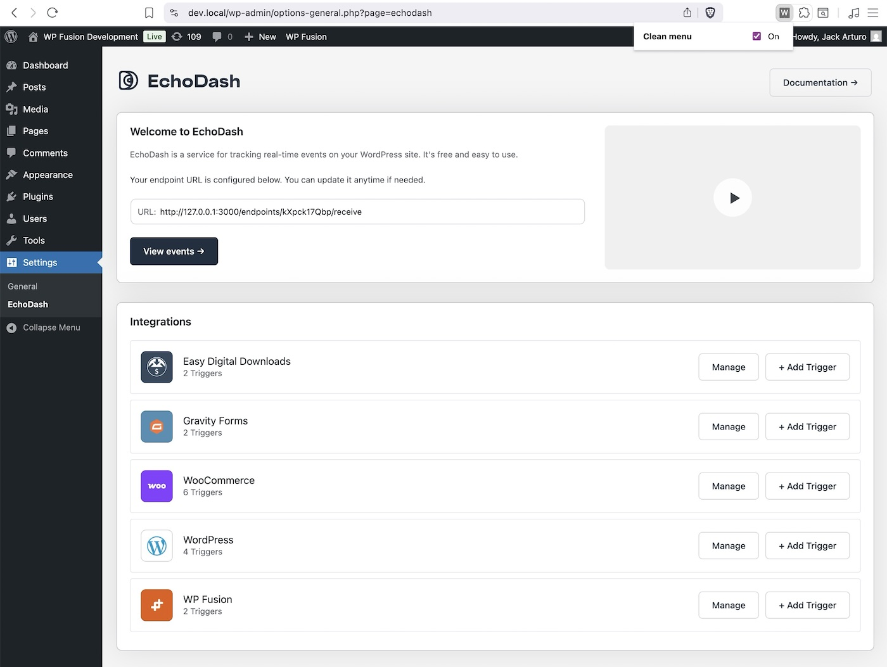

# WP Admin Menu Cleaner

A lightweight Chrome extension that cleans up the WordPress admin menu by hiding non-core items while preserving the current page's menu item. Perfect for clean screenshots, screencasts, and focused WordPress admin demos.



## ✨ Features

- **Smart Menu Cleaning**: Hides plugin and theme menu items while keeping WordPress core menus
- **Current Page Awareness**: Always shows the menu item for the page you're currently viewing
- **Submenu Support**: Cleans both top-level and submenu items
- **Persistent Across Navigation**: No flash or re-hiding when navigating between admin pages
- **Easy Toggle**: Simple on/off switch via extension popup
- **Zero Configuration**: Works out of the box with sensible defaults
- **Lightweight**: Minimal performance impact

## 🎯 What Gets Hidden

The extension hides all non-core WordPress admin menu items **except**:

### Always Visible (Core Items)
- Dashboard
- Posts  
- Media
- Pages
- Comments
- Appearance
- Plugins
- Users
- Tools
- Settings
- Profile
- Updates

### Contextually Visible
- Current page menu item (e.g., if you're on a plugin settings page, that plugin's menu stays visible)
- Parent menu items for editor screens (post.php, post-new.php map back to Posts/Pages)

## 📦 Installation

### From Chrome Web Store
[Install WP Admin Menu Cleaner](https://chromewebstore.google.com/detail/wp-admin-menu-cleaner/hjcofmagkkcnnghnnfpbingafegjaihd)

### Manual Installation (Developer Mode)

1. **Download or Clone**
   ```bash
   git clone https://github.com/verygoodplugins/wp-clean-admin.git
   cd wp-clean-admin
   ```

2. **Load in Chrome**
   - Open `chrome://extensions/`
   - Enable **Developer mode** (toggle in top right)
   - Click **Load unpacked**
   - Select the `wp-clean-admin` folder

3. **Start Using**
   - Visit any WordPress admin URL (`/wp-admin/`)
   - The extension activates automatically
   - Use the extension popup to toggle on/off

## 🚀 Usage

### Basic Usage
1. Navigate to any WordPress admin page
2. The extension automatically hides non-core menu items
3. Your current page's menu item remains visible

### Toggle Control
- Click the extension icon in Chrome's toolbar
- Use the **Clean menu** toggle to enable/disable
- Changes apply instantly to the current tab

### Perfect For
- **Screenshots**: Clean, professional WordPress admin screenshots
- **Screencasts**: Focused tutorials without plugin clutter
- **Client Demos**: Show core WordPress functionality without distractions
- **Documentation**: Consistent admin interface across different WordPress sites

## 🛠️ Technical Details

### Files Structure
```
wp-clean-admin/
├── manifest.json     # Chrome extension manifest (MV3)
├── content.js        # Main cleaning logic
├── popup.html        # Toggle interface
└── README.md         # This file
```

### How It Works
1. **Content Script**: Runs on all `/wp-admin/*` pages
2. **Menu Detection**: Identifies WordPress admin menu structure
3. **Smart Filtering**: Compares menu items against core WordPress slugs
4. **Current Page Logic**: Detects current page and preserves its menu item
5. **Dynamic Updates**: Uses MutationObserver to handle menu changes

### Browser Compatibility
- Chrome (Manifest V3)
- Edge (Chromium-based)
- Other Chromium browsers

## 🔧 Development

### Local Development
```bash
# Clone the repository
git clone https://github.com/verygoodplugins/wp-clean-admin.git
cd wp-clean-admin

# Load in Chrome for testing
# chrome://extensions/ → Developer mode → Load unpacked
```

### Customization
To modify which menu items are considered "core", edit the `CORE_MENU_SLUGS` set in `content.js`:

```javascript
const CORE_MENU_SLUGS = new Set([
  'index.php',                 // Dashboard
  'edit.php',                  // Posts
  // Add your custom items here
  'admin.php?page=my-plugin',  // Custom plugin page
]);
```

## 📝 License

MIT License - see [LICENSE](LICENSE) file for details.

## 🤝 Contributing

1. Fork the repository
2. Create a feature branch (`git checkout -b feature/amazing-feature`)
3. Commit your changes (`git commit -m 'Add amazing feature'`)
4. Push to the branch (`git push origin feature/amazing-feature`)
5. Open a Pull Request

## 🐛 Issues & Support

Found a bug or have a feature request? Please [open an issue](https://github.com/verygoodplugins/wp-clean-admin/issues).

## 📸 Screenshots

### Before and After


---

**Another [Very Good Plugin](https://verygoodplugins.com) made with ❤️ for the WordPress community**